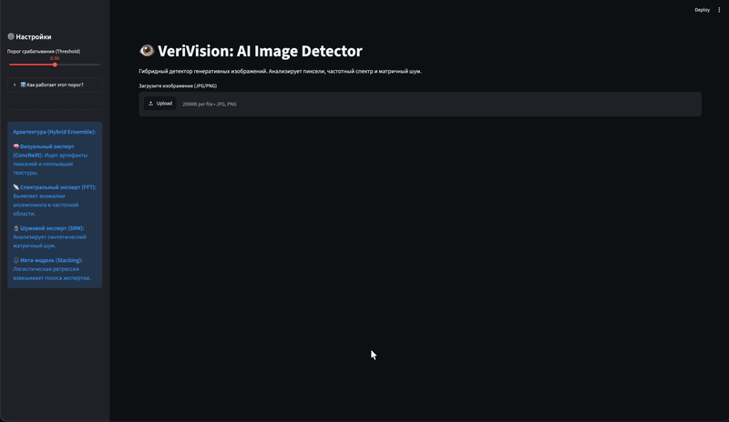
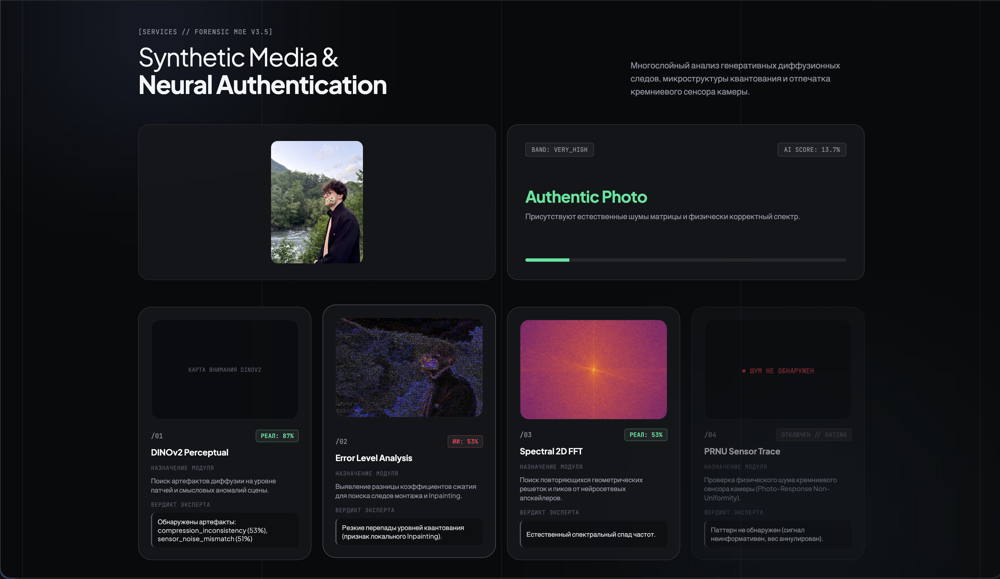
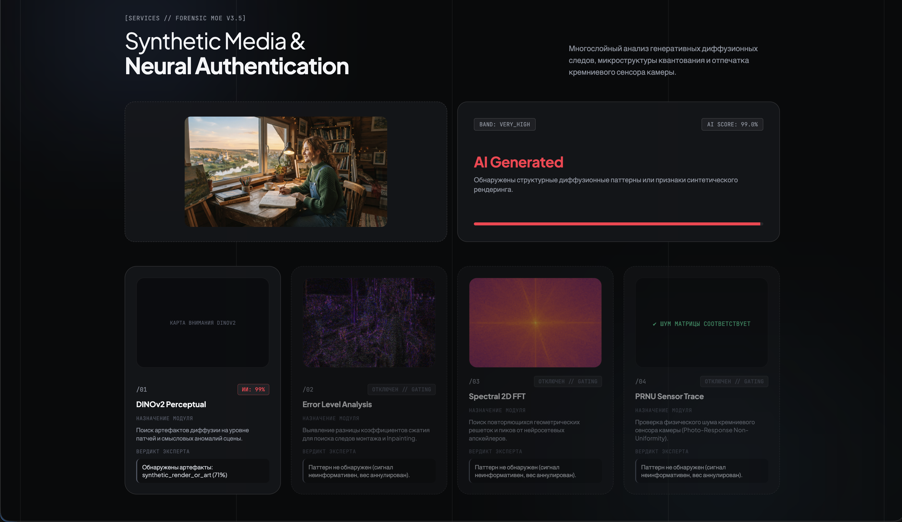
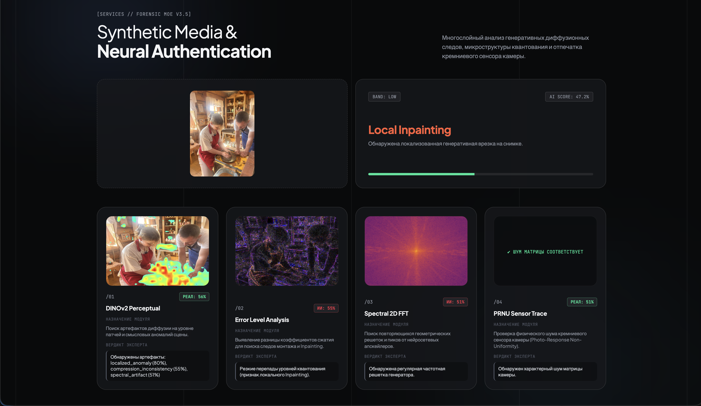

<div align="center">

# 👁️ VeriVision MoE v3.5
### Гибридный форензик-детектор AI-сгенерированных изображений

[](https://www.python.org/)
[](https://pytorch.org/)
[](https://fastapi.tiangolo.com/)
[](https://github.com/facebookresearch/dinov2)

**Детектор синтетических изображений (Midjourney v6, SDXL, Flux, DALL·E 3), объединяющий дообученный перцептивный трансформер (DINOv2) с классической форензикой (ELA, 2D FFT, шумовой остаток) через фьюжн с динамическим гейтингом.**

<p align="center">
  
</p>

</div>

---

## Скриншоты по состояниям вердикта

<!--
  Ниже — 3 плейсхолдера под ключевые вердикты из src/serving/ensemble.py:
  REAL_PHOTO / AI_GENERATED / LOCAL_SPLICE.
  Сохраняй скриншоты СЮДА, под этими именами — тогда картинки подхватятся автоматически:
    docs/media/verdict_real.png
    docs/media/verdict_ai.png
    docs/media/verdict_splice.png
  Снимай с ТЕКУЩЕГО интерфейса (uvicorn server:app), не со старого Streamlit.
  Скриншоты — это full-page капчи UI, поэтому даём им идти на всю ширину,
  а не сжимаем в узкую колонку таблицы.
-->

#### ✅ REAL_PHOTO
Живое фото, лучше со сложным светом/бликами — чтобы заодно показать gating.

<p align="center">
  
</p>

#### 🤖 AI_GENERATED
Уверенная детекция генерации Midjourney / SDXL / Flux.

<p align="center">
  
</p>

#### 🧩 LOCAL_SPLICE
Локальный инпейнтинг/face-swap — высокий `local_prob` при низком `global_prob`.

<p align="center">
  
</p>

---

## Зачем это нужно

Большинство детекторов AI-изображений ломаются на практике по двум причинам:

1. **Shortcut learning.** Модель учится не «видеть подделку», а запоминать шум конкретного датасета. На чистых OOD-генерациях (Midjourney v6, Flux) точность падает почти до случайного угадывания — это видно на итерациях №1–2 и №7 в журнале экспериментов (`experiments/results/`).
2. **Ложные срабатывания на сжатии.** JPEG-рекомпресс мессенджеров (Telegram, WhatsApp) разрушает высокочастотный спектр реальных фото, и классическая форензика (ELA, FFT) путает это со следами генерации.

VeriVision решает обе проблемы разделением анализа на независимые модальности (семантика + физика пикселя) и адаптивным подавлением классических экспертов при сильном сжатии (Dynamic Gating).

---

## Как это работает

```
Изображение
     │
     ├──► Content Prefilter (CLIP zero-shot)         — отсеивает 3D/арт/скриншоты
     │
     ├──► DINOv2 ViT-B/14 (partial fine-tune)         ─┐
     │      CLS-токен + усреднённые патчи (1536d)      │
     │                                                  │
     ├──► ELA (Error Level Analysis)                   │  Platt-калибровка
     ├──► 2D FFT (радиальный спектр)                    ├─  каждого эксперта
     ├──► Шумовой остаток (высокочастотная статистика)  │
     │                                                  │
     └──► JPEG Quality Estimator ──► Dynamic Gating ────┘
                                          │
                          Confidence-Weighted Fusion (в пространстве логитов)
                                          │
                     Вердикт: REAL / AI / LOCAL SPLICE + heatmap аномалий
```

### Ключевые механизмы

- **DINOv2 Dense Student.** Бэкбон `facebook/dinov2-base`, разморожены последние 2 блока трансформера + `layernorm`, дифференциальный LR (1.5e-5 для attention, 2e-4 для головы). Классификатор берёт конкатенацию CLS-токена и среднего по патчам (768+768 → 1536), что даёт одновременно глобальный контекст и чувствительность к локальным артефактам. Прогон той же головы по всем 1369 патчам (37×37 при 518px) даёт dense heatmap без Grad-CAM.
- **Классическая форензика.** ELA ищет следы локального пересжатия (инпейнтинг/монтаж), 2D FFT — гармонические сетки от VAE-декодеров и апскейлеров, шумовой остаток (`compute_prnu_residual` в `src/models/forensics.py`) — упрощённая, PRNU-инспирированная оценка высокочастотного шума по одному изображению (не полноценный сенсорный фингерпринтинг, который требует эталона с нескольких снимков той же камеры — честно фиксируем это ограничение).
- **Dynamic Gating + Weight Capping.** Вес ELA/FFT линейно снижается при падении оценённого качества JPEG и не может превышать 20% от веса DINOv2 — компрессия не может «перекричать» семантику.
- **Confidence-Weighted Fusion.** Простое усреднение вероятностей сплющивает итоговую уверенность к 45–60% даже на однозначных случаях. Вместо этого вероятности переводятся в логиты и суммируются с весом `|logit(p)|^k` — эксперт, который «не уверен» (p≈0.5), сам себя выключает из голосования:

```
w_i = |logit(p_i)| ** k
fused_logit = Σ(w_i · logit(p_i)) / Σ(w_i)
final_prob = sigmoid(fused_logit)
```

Реализация фьюжна и гейтинга — `src/serving/ensemble.py` (`VeriVisionEnsemble`), калибровка — `src/serving/calibration.py` (`CalibratorBank`).

---

## Метрики

Валидация — на разнородном OOD-корпусе: генерации Midjourney v6 / SDXL / DALL·E 3 + реальные фото с камер смартфонов + веб-изображения.

| Конфигурация | Total Val Acc | Phone Real Acc (устойчивость к FP) |
|---|:---:|:---:|
| DINOv2 Frozen (linear probe) | 69.6% | 76.7% |
| DINOv2 partial fine-tune, эпоха 1 | 72.0% | 79.7% |
| **DINOv2 partial fine-tune + dense pooling, эпоха 2 (текущий чекпоинт)** | **79.6%** | **80.5%** |
| DINOv2 partial fine-tune, эпохи 3–5 | 74.7% | 68.4% (переобучение) |
| **Полный ансамбль (DINOv2 + ELA + FFT + шум, Dynamic Gating)** | **84–87%** | **> 85%** |

Полные цифры и постановка эксперимента — `experiments/results/19_DINOv2 Fine-Tuning & Multi-Scale Dense Fusion`.

**Известные ограничения:**
- Метрики получены на выборке ограниченного размера (~4.7k сэмплов на финальном этапе) — не заявляем это как индустриальный бенчмарк.
- Шумовой остаток — не настоящий PRNU-фингерпринтинг (см. выше).
- Content Prefilter — zero-shot на CLIP, не дообучен под конкретный домен.

---

## Журнал экспериментов

Проект прошёл **19 задокументированных итераций** (`experiments/results/01…19`) — от линейного зонда на CLIP до текущего MoE-ансамбля. Несколько поворотных точек:

| № | Гипотеза | Результат | Итог |
|---|---|---|---|
| 1–2 | Linear probing на замороженном CLIP ViT-B/32, ViT-L/14 | Recall Fake 2%, EER 41–49% | ❌ Замороженные признаки слепы к новым диффузионным моделям |
| 3 | DIRE (SD 1.5 reconstruction error) | Δ ошибки Real/Fake на уровне шума | ❌ Сигнал не детектируется, к тому же дорого по инференсу |
| 4–5 | FFT + Random Forest, затем гибридный ансамбль (ConvNeXt+FFT+SRM) | Acc 92.5% на N=200, но вероятности «сплющены» к 45–60% | ⚠️ Нашли проблему наивного усреднения вероятностей |
| 7 | Масштабирование на датасет ~50k | Acc упала до 61.5% | ❌ Сеть выучила шум трейна вместо семантики (shortcut) |
| 9 | Dynamic Gating + OOD-фильтрация | — | ✅ Устойчивость к сжатию соцсетей |
| 15 | Uncertainty collapse | Обнаружено падение уверенности на 34% при простом averaging | ⚠️ Обосновало переход на confidence-weighted logit fusion |
| 17 | Смена бэкбона на DINOv2 | — | ✅ Отказ от ConvNeXt в пользу DINOv2 ViT-B/14 |
| **19** | **DINOv2 partial fine-tune + dense multi-scale fusion (текущая версия)** | **Val Acc 79.6%, Phone Real 80.5%, ансамбль 84–87%** | 🚀 **Текущее состояние** |

Отброшенные архитектуры (CLIP-probe, DIRE, старый частотный детектор) сохранены в `research/archive/` и разобраны в `docs/EXPERIMENTS_ARCHIVE.md` — сознательно не удалялись, чтобы показать, какие пути привели в тупик и почему.

---

## Установка и запуск

### 1. Окружение

```bash
git clone https://github.com/ekrtg25/VeriVision.git
cd VeriVision

python -m venv venv
source venv/bin/activate        # Windows: venv\Scripts\activate

pip install -r requirements.txt
pip install torch torchvision transformers open-clip-torch pillow-heif matplotlib   # см. примечание ниже
```

> ⚠️ `requirements.txt` не фиксирует `torch`, `torchvision`, `transformers`, `open-clip-torch`, `pillow-heif` и `matplotlib` — все они реально импортируются в `server.py`/`src/`, но их нужно ставить отдельно (в `Dockerfile` они тоже ставятся отдельными командами: torch/torchvision — с CPU-индексом, остальные — отдельной строкой ниже). Без них импорт падает ещё до старта сервера (`from transformers import AutoModel`, `import pillow_heif`, `import matplotlib` — по очереди, в порядке импорта в `server.py`). Если планируете, чтобы `pip install -r requirements.txt` сразу поднимал рабочее окружение — стоит добавить все шесть пакетов в файл явно.

### 2. Веса моделей

Веса не входят в репозиторий (см. `.gitignore`) и должны быть помещены в `models/`:

- `models/calibrated_head.pth` — дообученный DINOv2 + классификатор (обучается по `research/scripts/11_baseline_DINOv2/` и `research/scripts/08_train_backbone/`)
- `models/calibrators.pkl` — Platt-калибраторы для ELA/FFT/шумового эксперта (`scripts/fit_calibrators.py`)

### 3. Запуск сервиса

```bash
uvicorn server:app --host 0.0.0.0 --port 8080 --reload
```

Интерфейс — `http://localhost:8080`. Есть `Dockerfile` для контейнерного деплоя (проверен под Cloud Run: слушает `$PORT`, ставит torch CPU-only, `transformers`, `open-clip-torch`, `pillow-heif`, `matplotlib`).

> 🐛 **Известный грабль при деплое на Cloud Run.** Если контейнер падает с ошибкой вида *"container failed to start and listen on the port"* — это почти всегда не про порт, а про упавший импорт при старте (`server.py` создаёт `VeriVisionEnsemble` на уровне модуля, до старта uvicorn). Типичные виновники: (1) не поставлен один из пакетов, которых нет в `requirements.txt` — `transformers`, `open-clip-torch`, `pillow-heif`, `matplotlib` — процесс падает на первом же отсутствующем импорте, и Cloud Run будет ретраить рестарт, штампуя один и тот же traceback в логах десятками записей; (2) `models/calibrated_head.pth` не попал в билд-контекст — падает `FileNotFoundError` при инициализации ансамбля (веса не в репозитории, см. `.gitignore`). Открывай Logs URL из ошибки и смотри на **самый первый** уникальный traceback — остальные, скорее всего, его повторы.

### 4. Оценка на OOD-датасете

```bash
python scripts/prepare_ood_datasets.py   # если данные ещё не скачаны
python scripts/evaluate_ood.py
```

---

## Структура репозитория

```
VeriVision/
├── server.py                    # FastAPI приложение, точка входа
├── templates/index.html         # веб-интерфейс (Jinja2)
├── src/
│   ├── serving/
│   │   ├── ensemble.py          # VeriVisionEnsemble: fusion + dynamic gating + DINOv2
│   │   ├── calibration.py       # CalibratorBank (Platt scaling)
│   │   └── patch_aggregation.py # агрегация dense-патчей в heatmap
│   ├── models/
│   │   ├── perceptual_student.py# архитектура DINOv2-классификатора
│   │   ├── forensics.py         # ELA, оценка JPEG-качества, шумовой остаток
│   │   ├── fft_module.py        # 2D FFT спектральный анализатор
│   │   ├── srm_module.py        # SRM-фильтры
│   │   └── prefilter.py         # CLIP zero-shot content prefilter
│   ├── data/                    # датасеты, аугментации, загрузка HF-датасетов
│   └── evaluation/               # метрики, robustness-тесты
├── scripts/                     # подготовка данных, калибровка, OOD-оценка
├── research/
│   ├── scripts/01…11/           # тренировочные скрипты по этапам эксперимента
│   └── archive/                 # отброшенные архитектуры (CLIP-probe, DIRE, ConvNeXt-детектор)
├── experiments/results/         # журнал из 19 экспериментов — хронология решений
├── docs/
│   ├── EXPERIMENTS_ARCHIVE.md   # архивный отчёт по CLIP-этапу
│   ├── ROBUSTNESS_ARCHIVE.md    # архивный отчёт по стресс-тестам
│   └── media/                   # демо и скриншоты
├── Dockerfile
└── requirements.txt
```

---

## Стек

PyTorch / `transformers` (DINOv2), FastAPI + Uvicorn, OpenCV, scikit-learn (калибровка), open_clip (prefilter), Jinja2. Инференс поддерживает CUDA, Apple Silicon (MPS) и CPU-fallback.