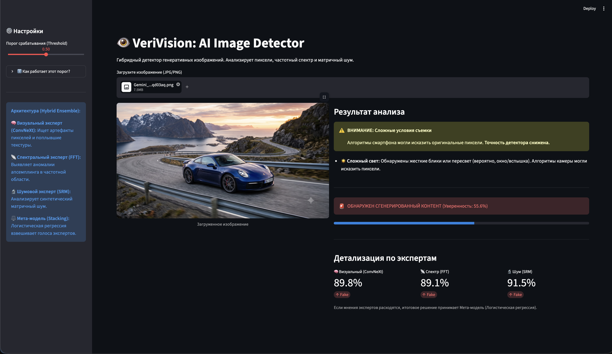
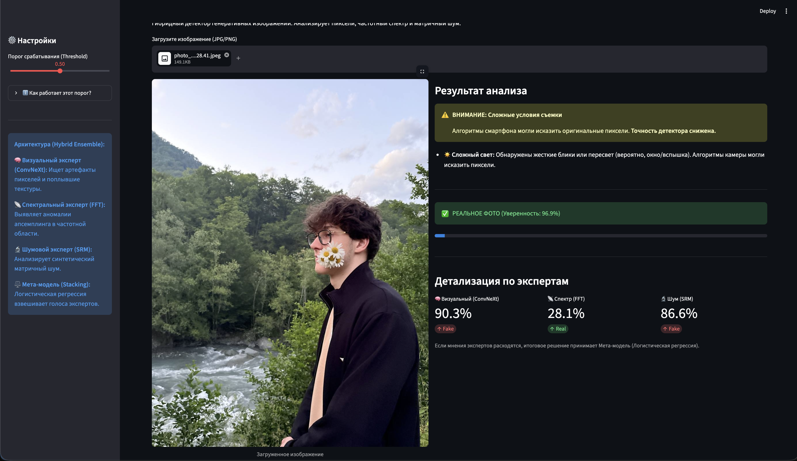

<div align="center">

# 👁️ VeriVision

**Contextual Mixture-of-Experts detector for AI-generated images**

Ловит генерации Midjourney v6, DALL-E 3, Stable Diffusion 3/XL — там, где тяжёлые CLIP-детекторы общего назначения слепнут. Три узких эксперта (семантика / физика частот / матричный шум) + динамический OpenCV-гейтинг против ложных срабатываний на "сложных" телефонных фото + стекинг-мета-модель вместо ручных эвристик.

<!--
  МЕСТО ДЛЯ GIF/СКРИНШОТА №1 (главный, самый важный):
  Запись экрана 5-10 сек: загружаете фото → показывается вердикт + разбивка по трём экспертам.
  Сохранить как docs/media/demo.gif и раскомментировать строку ниже.
-->


</div>

---

## Содержание

- [Зачем этот проект](#зачем-этот-проект)
- [Демо](#демо)
- [Как это устроено](#как-это-устроено)
- [Как система принимает решение (пример)](#как-система-принимает-решение-пример)
- [Путь экспериментов: 8 итераций, 3 тупика](#путь-экспериментов-8-итераций-3-тупика)
- [Метрики](#метрики)
- [Известные ограничения и roadmap](#известные-ограничения-и-roadmap)
- [Установка и запуск](#установка-и-запуск)
- [Обучение экспертов с нуля](#обучение-экспертов-с-нуля)
- [Структура проекта](#структура-проекта)
- [Технологический стек](#технологический-стек)

---

## Зачем этот проект

Большинство детекторов AI-изображений решают одну задачу и провально решают другую: либо ловят генерации ценой огромного числа ложных срабатываний на реальных фото (переснятых со сложным светом, HDR, размытием в движении), либо наоборот — идеально классифицируют чистые датасетные картинки, но полностью слепнут на генераторе, которого не видели в трейне (classic *shortcut learning*: сеть запоминает артефакты конкретного датасета, а не признаки того, что изображение синтетическое).

VeriVision — попытка решить обе проблемы одновременно за счёт того, что три эксперта смотрят на принципиально разные, физически независимые сигналы, а лёгкий OpenCV-гейт заранее "предупреждает" ансамбль, что перед ним не датасетное фото, а что-то более грязное, — вместо того чтобы позволять модели молча угадывать.

## Демо

<!--
  МЕСТО ДЛЯ СКРИНШОТОВ №2-4. Рекомендую 3 штуки рядом (таблица ниже уже под них готова):
  1) Явный фейк (Midjourney) — уверенный красный вердикт + высокие проценты у всех трёх экспертов
  2) Реальное фото в нормальных условиях — уверенный зелёный вердикт
  3) Самое ценное: реальное фото с бликами/шевелёнкой — сработавшее предупреждение
     "Сложные условия съемки" из app.py (это ваш главный дифференциатор, обязательно покажите)
  Сохранить в docs/media/screenshot_fake.png, screenshot_real.png, screenshot_gating.png
-->

**Фейк уверенно пойман**


**Реальное фото**


**Гейтинг спасает от false positive**


Живое демо: `streamlit run app.py` — см. [Установка и запуск](#установка-и-запуск).

## Как это устроено

Вместо одной тяжёлой сети — три узких независимых эксперта, каждый ловит свой класс артефактов, плюс мета-модель, которая честно взвешивает их голоса.

| Эксперт | Метод | Файл | Что ловит |
|---|---|---|---|
| 🧠 Визуальный | ConvNeXt-Tiny, Linear Probing + Anti-Artifact Head (`Dropout p=0.4`) | `src/models/baseline_cnn.py` | Семантические артефакты, "поплывшие" текстуры, анатомические ошибки |
| 📡 Спектральный | 1D радиальный профиль мощности FFT + Random Forest | `src/models/fft_module.py` | Следы апсемплинга и шахматные паттерны, характерные для диффузионных генераторов |
| 🔬 Шумовой | SRM-фильтры (Spatial Rich Models) + Random Forest | `src/models/srm_module.py` | Статистика (дисперсия/асимметрия/эксцесс) синтетического матричного шума |

**Dropout(0.4) в голове ConvNeXt — не случайная деталь.** Это прямой ответ на shortcut learning: без него сеть на большом датасете (эксперимент №7) вызубрила артефакты сжатия конкретного трейна и полностью ослепла на чистых генерациях Midjourney v6 (Recall упал до 29%, см. журнал экспериментов ниже). Dropout заставил сеть опираться на высокоуровневую семантику вместо пиксельной зубрёжки.

### Динамический OpenCV-гейтинг

Перед тем как довериться визуальному и шумовому экспертам, лёгкий эвристический фильтр (`_compute_gating_weights` в `ensemble.py`) за миллисекунды проверяет, не "грязное" ли это фото:

- **Пересвет / жёсткий HDR**: доля пикселей ярче 240 > 1%, при этом кадр не однородно светлый (`mean_brightness < 180`) — типичный признак смартфонного HDR/бликов, а не подлинной генерации.
- **Motion blur**: дисперсия Лапласиана < 75 — сильное размытие в движении.

Если сработало хоть одно условие — вероятности визуального (`w=0.3`) и шумового (`w=0.3`) экспертов притягиваются к 0.5 (состоянию "не знаю"), потому что именно эти два сигнала чувствительны к бликам и шуму матрицы. Спектральный эксперт (`w=1.0`) остаётся нетронутым — частотный профиль устойчивее к освещению. UI (`app.py`) честно показывает пользователю предупреждение "Сложные условия съёмки" вместо того, чтобы молча выдать неверный вердикт.

```python
gated_prob = 0.5 + (raw_prob - 0.5) * weight   # weight ∈ {0.3, 1.0}
```

### Мета-модель: Stacking, а не ручные веса

Финальное решение принимает не среднее и не эвристическая формула, а **логистическая регрессия** (`models/meta_classifier.pkl`), обученная поверх (уже прогейченных) вероятностей трёх экспертов. Почему не просто среднее — см. эксперимент №6 ниже: простое усреднение "сплющивает" итоговую уверенность к 45–60% даже на однозначных случаях, потому что неуверенный эксперт (`p≈0.5`) тянет уверенного к центру. Обученная регрессия сама нашла контринтуитивный, но рабочий баланс: физическим экспертам (FFT, SRM) она назначила вес почти в 2.5 раза выше, чем нейросети — потому что "мягкие" предсказания случайных лесов (0.45–0.55) нуждаются в усилении на фоне радикальных 0.01/0.99 у ConvNeXt.

## Как система принимает решение (пример)

```
Вход: фото человека у окна, яркий контровой свет из окна
  │
  ├─ OpenCV-гейт: overexposed_ratio = 3.2%, mean_brightness = 140 → УСЛОВИЕ СРАБОТАЛО
  │
  ├─ 🧠 ConvNeXt:  raw = 0.81 (Fake)  → gated = 0.5 + (0.81-0.5)*0.3 = 0.593
  ├─ 📡 FFT:       raw = 0.22 (Real)  → gated = 0.22  (вес не менялся)
  ├─ 🔬 SRM:       raw = 0.77 (Fake)  → gated = 0.5 + (0.77-0.5)*0.3 = 0.581
  │
  └─ Meta-model (LogisticRegression) → final_score = 0.34 → REAL ✅
     UI дополнительно показывает: "☀️ Сложный свет: возможны искажения пикселей"
```

Без гейтинга ConvNeXt и SRM тянули бы вердикт в сторону Fake из-за бликов — гейтинг возвращает решающий голос спектральному эксперту, который не обманывается светом.

## Путь экспериментов: 8 итераций, 3 тупика

Полный журнал — в [`experiments/results/`](experiments/results/), это документированный ML-дневник с метриками, гипотезами и постмортемами каждого шага. Вот его сжатая хронология, потому что путь важнее конечной цифры:

| # | Подход | Результат на OOD (Midjourney v6) | Вердикт |
|---|---|---|---|
| 1 | ConvNeXt + CLIP ViT-B/32, Uncertainty Fusion | Recall 2%, EER 41% | ❌ Сеть в принципе не видит новые генерации |
| 2 | То же + тяжёлый CLIP ViT-L/14 | Recall 2%, EER 49% (хуже случайного) | ❌ Больше параметров не помогает замороженному энкодеру |
| 3 | DIRE — diffusion reconstruction error (SD 1.5) | Δ ошибки Real/Fake = 0.009 (шум) | ❌ SD 1.5 слишком слаб, чтобы "понять" MJv6; упрощённая инверсия убила сигнал |
| 4 | Pivot: 1D FFT-профиль + Random Forest | **Recall 84%** 🚀, Accuracy 75% | ✅ Прорыв, но много ложных срабатываний на реальных фото (Recall Real 67%) |
| 5 | Hybrid: CNN + FFT + SRM, простое усреднение | Accuracy 92.5%, Recall 96%, EER 8% *(тестовая выборка — 200 изображений)* | ✅ Резкий скачок, но выборка крошечная и вероятности "сплющены" в 45–60% |
| 6 | Попытки калибровки: Stacking / Logit-Stacking / агрессивный Temperature Scaling | Accuracy просела до 75%, Temperature Scaling дал красивые проценты, но признан "косметическим хаком" | ❌ Переобучение мета-модели на 200 примерах; честной калибровки не нашли |
| 7 | Platt Scaling экспертов + Confidence-Weighted Logit Fusion, переход на датасет `AI-vs-Real` (~50k фото) | Accuracy рухнула до 61.5%, Recall (Fake) 29% | ❌ Classic shortcut learning: ConvNeXt вызубрил артефакты конкретного датасета, ослеп на чистых генерациях MJv6 |
| **8** | **Data Diet → Defactify (42k, MJv6/DALL-E3/SD3/SDXL/SD2.1 vs COCO) + Anti-Artifact Head (Dropout 0.4) + Stacking meta-model** | **Accuracy 86%, Precision 0.90, Recall 0.88, F1 0.89** *(hold-out, 1500 изображений, кросс-генератор)* | ✅ Текущее production-состояние |

Самое ценное здесь — не финальная цифра, а то, что каждый провал дал конкретную, проверяемую гипотезу для следующего шага: от "нужен более мощный энкодер" (не помогло) → к "нужна другая модальность сигнала, не семантика" (FFT — сработало) → к "нужна честная, устойчивая к малым данным агрегация" (Stacking) → к "нужно бороться с зубрёжкой конкретного датасета явно" (Dropout-регуляризация).

## Метрики

**Текущая архитектура (Experiment 8), hold-out валидация — 1500 изображений, датасет Defactify:**

| Метрика | Значение |
|---|---|
| Accuracy | 86.0% |
| Precision (Fake) | 0.90 |
| Recall (Fake) | 0.88 |
| F1-Score (Fake) | 0.89 |

Fake-класс в этой выборке — смесь Midjourney v6, DALL-E 3, Stable Diffusion 3, SDXL, SD 2.1; Real-класс — MS COCO. То есть это уже кросс-генераторная оценка, а не тест на одном генераторе.

**Более ранний, узкий OOD-тест (только Midjourney v6 vs Unsplash, 200 изображений, эксперимент №5, ещё без гейтинга и стекинга):** Accuracy 92.5%, Recall 96%, EER 8%. Число выше, но выборка слишком мала и однородна, чтобы использовать её как основную заявленную метрику проекта — она осталась в репозитории как историческая точка сравнения в `experiments/results/05_hybrid_ensemble.md`.

## Известные ограничения и roadmap

Честный список, а не список того, что "скоро добавим":

- **RF-эксперты не откалиброваны отдельно.** `fft_prob`/`srm_prob` — сырой выход `predict_proba` случайного леса, который систематически занижает уверенность из-за природы голосования деревьев. Раздельная Platt-калибровка каждого эксперта до фьюжна — в планах (см. `experiments/results/06_calibration_attempts.md`).
- **`scripts/evaluate_ood.py` рассинхронизирован с текущим API.** Скрипт читает `result["ensemble_prob"]`, а актуальный `HybridEnsembleDetector.predict()` возвращает `final_score` — скрипт нужно поправить перед следующим прогоном OOD-бенчмарка.
- **Устойчивость к сжатию соцсетей не протестирована на текущей архитектуре.** Ранние прогоны на CLIP-версии ансамбля (`docs/ROBUSTNESS_ARCHIVE.md`) показали, что и CNN, и FFT-эксперт серьёзно деградируют на JPEG-пережатых и зашумлённых изображениях — а это самый частый реальный сценарий (фото, перезалитое в Telegram/Instagram). Нужно повторить эти стресс-тесты на гибридном ансамбле с гейтингом.
- **Валидационная выборка для генерализации всё ещё умеренного размера (1500 изображений).** Leave-one-generator-out тест (обучение без одного из пяти генераторов, тест именно на нём) пока не проводился — это самая сильная проверка того, что Anti-Artifact Head действительно решает shortcut learning, а не просто улучшает метрику на знакомых генераторах.
- **`Dockerfile` пустой** — контейнеризация ещё не сделана.

## Установка и запуск

```bash
python -m venv venv
source venv/bin/activate   # Windows: venv\Scripts\activate
pip install -r requirements.txt
```

Веса моделей нужно положить в `models/` (в репозиторий не входят, кроме RF):

- `baseline_weights.pth` — веса ConvNeXt-Tiny, обучаются через `research/scripts/05_hybrid_ensemble/`
- `rf_spectral.pkl`, `rf_srm.pkl` — веса Random Forest (входят в репозиторий)
- `meta_classifier.pkl` — веса мета-модели (LogisticRegression), обучается на этапе Stacking

**Веб-интерфейс:**

```bash
streamlit run app.py
```

Загрузите изображение — приложение покажет вердикт ансамбля, честное предупреждение о сложных условиях съёмки (если гейтинг сработал) и разбивку по каждому эксперту. Порог срабатывания настраивается ползунком.

**Оценка на OOD-датасете:**

```bash
python scripts/prepare_ood_datasets.py   # если данные ещё не скачаны
python scripts/evaluate_ood.py           # см. известное ограничение выше — сверьте ключ ensemble_prob/final_score
```

## Обучение экспертов с нуля

Тренировочные скрипты сгруппированы по этапам эксперимента в `research/scripts/`:

- `01_baseline/` — первая ResNet/ConvNeXt-версия визуального эксперта
- `02_clip_vit_l/` — эксперименты с CLIP/ViT-L (отброшены, см. `docs/EXPERIMENTS_ARCHIVE.md`)
- `03_dire/` — эксперименты с DIRE-реконструкцией (отброшены)
- `04_spectral_srm/` — обучение спектрального и шумового экспертов
- `05_hybrid_ensemble/` — дообучение визуального эксперта под гибридный ансамбль
- `06_calibration/` — попытки калибровки порога/вероятностей (отброшенные подходы, см. эксперимент №6)

Финальные шаги — Anti-Artifact Head, обучение на Defactify и Stacking мета-модели (эксперименты №7–8) — задокументированы в `experiments/results/07_calibrated_fusion_and_overfitting.md` и `08_stacking_and_robust_cnn.md`.

## Структура проекта

```
VeriVision/
├── app.py                     # Streamlit-приложение — точка входа
├── scripts/
│   ├── evaluate_ood.py        # прогон ансамбля на OOD-датасете
│   └── prepare_ood_datasets.py
├── src/
│   ├── serving/
│   │   ├── ensemble.py        # HybridEnsembleDetector — гейтинг + стекинг трёх экспертов
│   │   └── gradcam.py         # визуализация внимания ConvNeXt
│   ├── models/
│   │   ├── baseline_cnn.py    # ConvNeXt-Tiny + Anti-Artifact Head
│   │   ├── fft_module.py      # SpectralAnalyzer
│   │   └── srm_module.py      # SRMAnalyzer
│   ├── data/                  # датасеты и трансформации
│   └── evaluation/            # метрики, тесты на устойчивость
├── research/
│   ├── archive/                # отброшенные архитектуры (CLIP-probe, DIRE, старый Frequency-детектор)
│   └── scripts/                # тренировочные скрипты по этапам 01-06
├── experiments/results/        # журнал экспериментов — хронология решений (01-08)
├── docs/                        # архивная документация ранних этапов (CLIP-эра)
└── models/                      # веса (rf_spectral.pkl, rf_srm.pkl входят в репо; остальное — обучается)
```

## Технологический стек

**ML & CV:** PyTorch, torchvision (ConvNeXt-Tiny), scikit-learn (Random Forest, LogisticRegression), OpenCV, SciPy (skew/kurtosis для SRM), NumPy
**UI:** Streamlit
**Железо для обучения:** Apple Silicon (MPS backend) / CUDA

---

<div align="center">

Автор: [ваше имя] · [ссылка на LinkedIn/почту]

</div>
